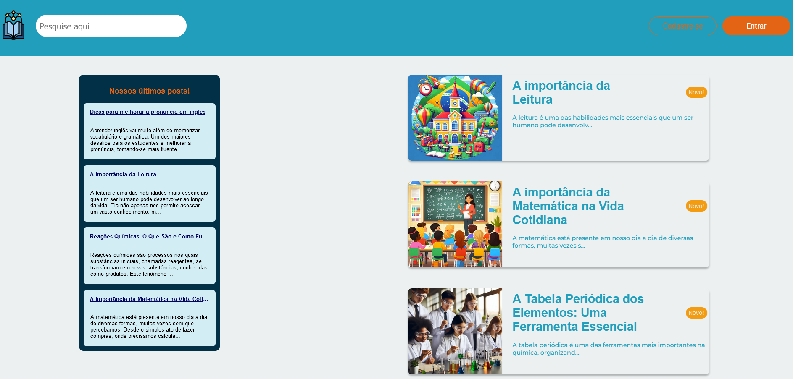
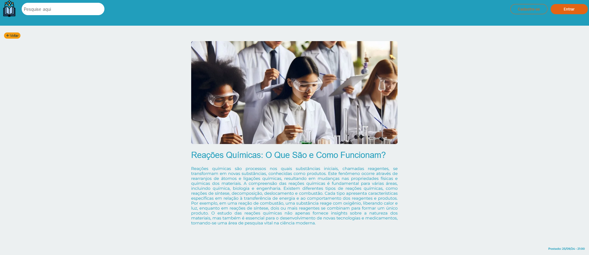
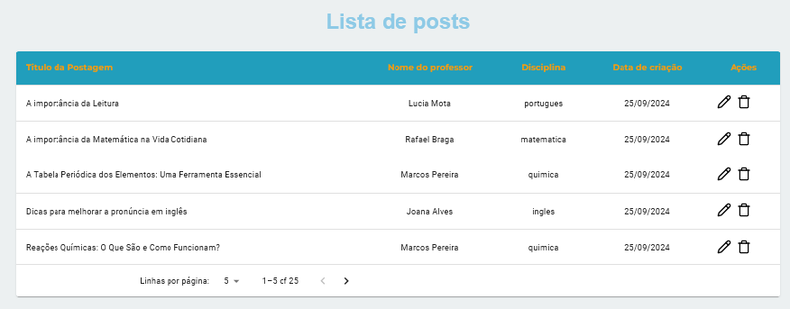

# Tech Challenge 03 - Frontend (Grupo 08)

Projeto com o desafio para o terceiro módulo do curso Full Stack Development - Pós Tech

    


## Ambiente de Produção Disponível

Link do ambiente de produção, onde o Github actions está executando o CI e o Render está executando o CD:

[Abrir link do Projeto](https://tech-challenge3.grupo8.tech/)

```
https://tech-challenge3.grupo8.tech/
```

## Autores

Grupo 08:

    Carolina de Araujo Nogueira Tinen  RM353510
    Esdras de Souza Mendes RM356127
    Lucas de Morais Nascimento Taguchi RM355982
    Marco Antonio Valentim Machado Junior RM354344
    Thiago Lima Dyonisio RM355323

## Requisitos

    - Implementação em Vite com TypeScript em React;
    - Estilização e responsividade com SASS e styled-components;
    - Integração com back-end;
    - Utilização de container Docker;
    - CI/CD com Github Actions;
    - Documentação.


## Para rodar o projeto localmente

É necessário verificar a documentação da API que está no repositório `https://github.com/thiagoconsult/tech-challenge2` para rodá-la, da seguinte forma:

Clone o projeto

```bash
  git clone https://github.com/thiagoconsult/tech-challenge2
```

Vá para o diretório do projeto

```bash
  cd tech-challenge2
```

Instale as dependências

```bash
  npm install
```

Rode o comando para subir o container do Docker com uma instância do banco de dados Postgres. O arquivo de configuração do compose.yaml busca as variáveis `POSTGRES_USER`, `POSTGRES_PASSWORD` e `POSTGRES_DB` das variáveis de ambiente (.env).

```bash
  docker compose up -d
```

Inicie o servidor

```bash
  npm run start:dev
```

Com a API rodando, é possível executar o projeto do front, seguindo esses passos:

Clone o projeto

```bash
  git clone https://github.com/lucasmoraist/blogging-web.git
```

Vá para o diretório do projeto

```bash
  cd blogging-web
```

## Variáveis de ambiente

Para rodar este projeto localmente, você precisará adicionar a variável de ambiente `VITE_API_URL` a um arquivo .env, como listado no .env.example.

Instale as dependências

```bash
  npm install
```

Inicie o servidor

```bash
  npm run dev
```
# Prints de telas do Blog




## Licença de utilização

[MIT](https://choosealicense.com/licenses/mit/)